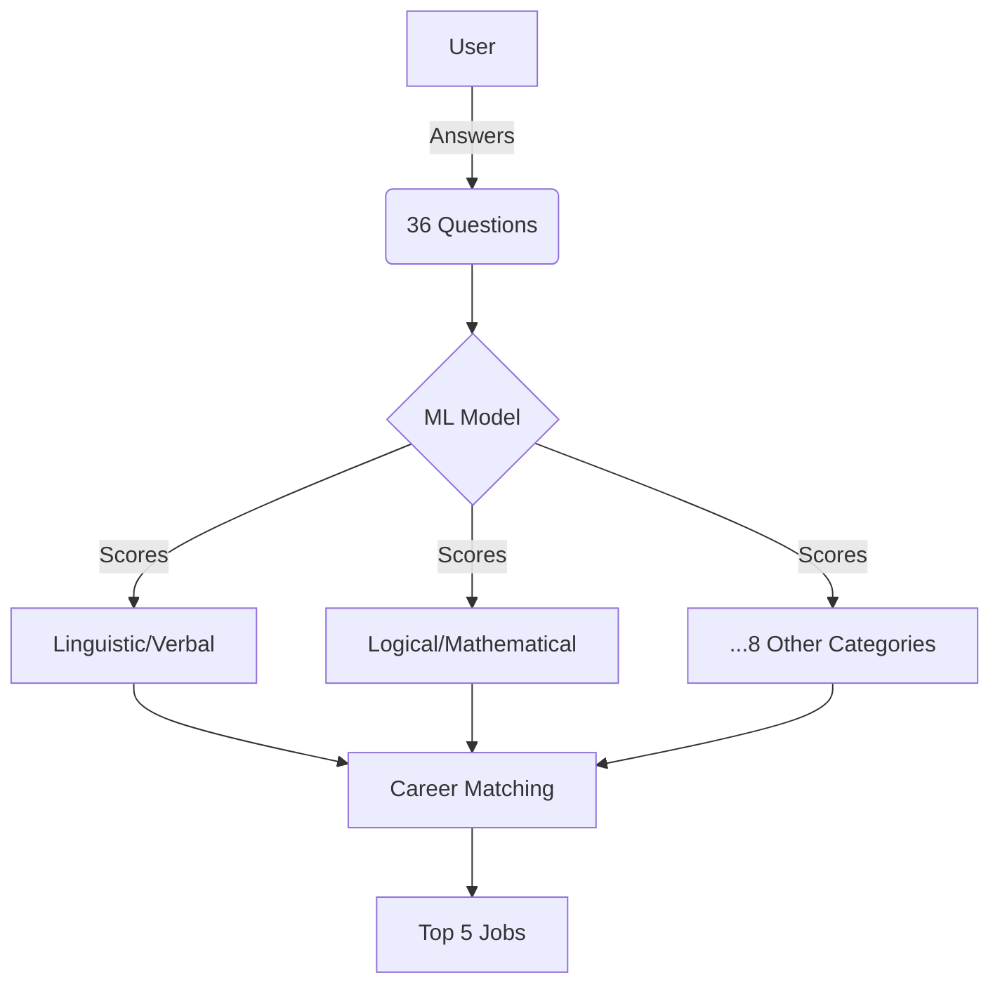

# 🎯 Career Guidance System 🚀
### *A Multiple Intelligences-Based Career Recommender* 🌟

<div align="center">
  
  <br>
  
  [](https://github.com/yourusername/CareerPath-Genius)
  [](https://php.net/)
  [](https://xgboost.ai/)
</div>

---

## 🌈 **Your Career Compass in the Modern World**  
> *"Choose a job you love, and you will never have to work a day in your life."* - Confucius

**Career Guidance System** is not just another career quiz — it’s a **data-driven journey** to uncover careers that align with your *innate strengths* 💪. Built on **Howard Gardner’s Multiple Intelligences Theory**, this system analyzes your responses to 36 carefully crafted questions 📝, maps them to **9 intelligence categories** 🧩, and uses machine learning 🤖 to recommend careers where you’ll naturally excel.

### ❗ **Why This Matters**  
- 73% of professionals feel stuck in mismatched careers *(LinkedIn 2023)*  
- Traditional career tests focus on *skills*, not *intrinsic abilities*  
- **Our innovation**: Combine psychology + AI to reveal *what makes you unique*  

📊 **Did You Know?** 67% of professionals regret their initial career choices (Gallup 2023).


### 🔍 **How It Works**  
🎯 **3-Step Magic:**  
1. 🧠 **36-Question Quiz** - Assess your multiple intelligences  
2. 🤖 **AI Analysis** - XGBoost model matches your strengths  
3. 💼 **Career Mapping** - Get 5 personalized job recommendations  

<div align="center">
  
</div>

---
  

## 🛠️ **Under the Hood**  



---

## 🎁 **Key Features That Make Us Unique**  

| Feature | Description |
|---------|-------------|
| **Multiple Intelligences Assessment** | 🧩 Based on Howard Gardner's groundbreaking theory |
| **Dynamic Progress Tracking** | 📊 Real-time quiz progress with visual feedback |
| **Smart Career Matching** | 🤖 ML model trained on 1000+ career patterns |
| **Interactive Job Cards** | 💼 Explore careers with images/descriptions |
| **Secure Authentication** | 🔒 Protected user accounts with session management |

## 🖥️ Tech Stack

| Component         | Technologies Used                             |
|------------------|------------------------------------------------|
| **Frontend**      | HTML5, CSS3, JavaScript                        |
| **Backend**       | PHP 7+                                         |
| **Database**      | MySQL                                          |
| **Machine Learning** | Python, XGBoost, scikit-learn, Pandas     |
| **Visualization** | Chart.js *(Planned for future enhancement)*   |

## 📥 Installation

### ✅ Requirements

- Web Server: **XAMPP** / **WAMP**
- **Python 3.8+**
- **MySQL 5.7+**

---

### ⚙️ Setup Steps

#### 1. Clone the Repository

```bash
git clone https://github.com/yourusername/career-guidance-system.git
cd career-guidance-system
```

#### 2. Database Setup

```sql
CREATE DATABASE project01;
USE project01;
CREATE TABLE signup (...);  # Add full schema from SQL file
```

#### 3. Python Dependencies
```bash
pip install -r requirements.txt
```

#### 4. Train ML Model
```bash
python train_model.py
```

#### 5. Configure PHP
```php
# Update config.php with your credentials
$host = 'localhost';
$dbname = 'project01';
$username = 'your_db_user';
$password = 'your_db_pass';
```

## 🖥️ Usage

### 👤 User Registration

```bash
Navigate to → Sign Up → Enter details → Submit
```

### 📝 Take Assessment

```bash
Home Page → Take Test → Answer 36 questions
```

### 📊 View Results

```bash
{
  "Recommended Jobs": ["Data Scientist", "Software Engineer", ...],
  "Top Intelligences": ["Logical/Mathematical", "Spatial/Visual", ...]
}
```

## 🔮 Future Enhancements

- [ ] Chatbot integration for career counseling  
- [ ] Password encryption using **bcrypt**  
- [ ] Admin dashboard for content management  
- [ ] Multi-language support (e.g., Hindi, Regional languages)  
- [ ] Interactive career growth timelines

## 📜 License

This project is licensed under the **MIT License** – see the [LICENSE](LICENSE) file for details.

## 🤝 Contributing

We are open for contributions! Please feel free to:

- Fork the repository
- Open an issue for discussion
- Submit a pull request with your improvements or bug fixes

We encourage collaboration and appreciate your help in making this project better!

---

<div align="center"> 
  Made with ❤️ by Krishna Madhumita Dutta • Need help? 📧 krishnamadhumitadutta@gmail.com
</div>


